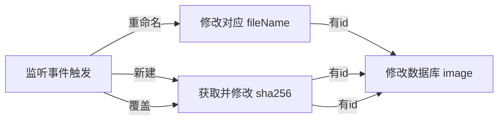

## 缩略图生成策略

### 触发条件

- 新建 / 导入 漫画后

- 更新 漫画 图片后（从 `Temp` 引入新的图片到 `Image`）

- 手动

- 手动强制

> 感觉自动的可以扔个 trigger 到 `Image` 实体上

### 更新策略

当且仅当 `id` 相同 `sha256` 不同时，生成并更新。

> 强制不受限

## 漫画添加策略

### 综述

比如此时有如下路径结构的漫画

```
 demo
    |-- comic
        |-- Demo Comic 1
        |   |-- 0001.png
        |   |-- 0002.png
        |   |-- 0003.png
        |   |-- 0004.png
        |-- Demo Comic 2
            |-- 0001.png
            |-- 0002.png
            |-- 0003.png
            |-- 0004.png
```

其中

若欲从 `comic` 导入子目录下所有漫画（如 `Demo Comic 1` 和 `Demo Comic 2`），则应使用 `从父文件夹导入多个漫画`；

若欲批量导入 `Demo Comic 1` 和 `Demo Comic 2`，则应使用 `从文件夹导入多个漫画`；

而 `创建漫画` 则是新建一个空的项目。

### 手动创建

通过 `images` 字段存放 `Temp` 实体 `id`，将 `Temp` 引入到 `Image`，而后从 `cover` 获取设置封面的 `Image` 的 `id`。

## 标签策略

标签格式为 `name:value`，如 `artist:xxxx`、`translator:xxxx`、`language:Chinese` 等类似于 E-hentai 的标签。

## 元信息策略

采用 **密码唯一** 的 **标签黑白名单** 规则集方案，如创建一个密码为 `93`，白名单标签 `male:males only` 的规则时，使用密码 `93` 登录后，只能查看该标签下的漫画。

## 自动导入策略

### 内部文件夹监听

监听文件夹变更（目前仅支持本地存储），同时，通过在文件夹中生成的 `.coviewer-config.json` 来识别于漫画的绑定关系（优先级最高）。

#### `.coviewer-config.json`

`data.id` 为记录在 `image` 数据库中的对应 `id`，该字段可选存在，如不存在，则意味着该图片*仅存在于存储目录中*，而并没有注册在数据库中。

```json
{
    "id": 1,
    "created": 1688600768140,
    "lastModified": 1688600768140,
    "data": [
        {
            "id": "e1-qLkYnL3bypK3yP0Vzt",
            "fileName": "000001.png",
            "sha256": "84dcc0a8ac83e4f697b9d30d15b63c02c87a07876b123a9dcce994dd2f917fb3"
        },
        {
            "fileName": "000002.png",
            "sha256": "5994471abb01112afcc18159f6cc74b4f511b99806da59b3caf5a9c173cacfc5"
        }
    ]
}
```




### 从目录名自动识别信息

有如下示例文件名 (EhViewer)

```
1159196-(FF30) [Wild Style (Takemoto Arashi)] WARM UP [Chinese]

1167755-[アイディバイド (ガンマカオス)] 霊獣石アンバーキューブ [中国翻訳]

2460718-[中文] 友情突破-EP1 [树生汉化]
```

其中正则格式为 `id-标题`，tag 通过自定义规则来识别。

如 `language:Chinese` 实体可以为

```json
{
    "id": 1,
    "value": "language:Chinese",
    "name": "中文",
    "rules": [
        {
            "type": "includes",
            "value": "chinese"
        },
        {
            "type": "includes",
            "value": "Chinese"
        },
        {
            "type": "includes",
            "value": "中文"
        },
        {
            "type": "regex",
            "value": "/chinese/"
        }
    ]
}